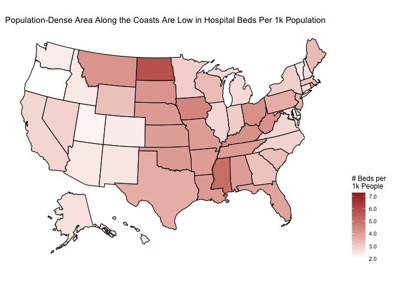
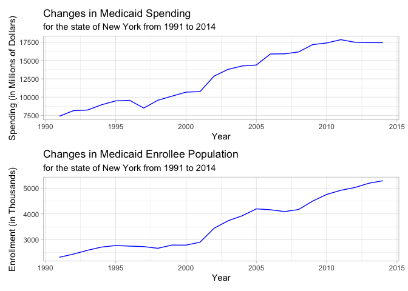

## Introduction
***
The beginning of this new decade has been marked by significant uncertainty and difficulty. Coronavirus disease (COVID-19) originated in Wuhan, China in December 2019, but was not declared a Public Health Emergency of International Concern by the World Health Organization (WHO) until January 30. On March 11, WHO recognized the coronavirus as a pandemic  and on March 13, the United States declared a national emergency. 

After Donald Trump declared a national emergency, life as we knew it in America was largely disrupted: schools, colleges and universities closed, restaurants and bars prohibit dining in, and companies have shifted to remote work.  Stay-at-home and shelter-in-place orders have been in place across the nation, but individual responses per state have been largely variable. Responses by state are primarily dependent upon their healthcare system’s capacity. Testing has not been universally accessible and the number of necessary equipment (i.e., ventilators) is not up to standard, across the board.  

Coronavirus has been shown to impact marginalized communities at a more intense rate, but nobody is immune to the virus. Nationwide, access to specialized medical care is highly dependent upon one’s socioeconomic and employment status. Thus, we wanted to take a deeper look into these access disparities in the age of a global pandemic. Changes to healthcare policy, such as the Affordable Care Act of 2010 (ACA), have made inexpensive healthcare available to more constituents. However, there is still a long way to go, and the virus has brought many of these inequalities to light.

The following questions guided our research in investigating nationwide healthcare inequity: 

**1.	Are there disparities in healthcare access across the United States?**

**2.	As New York was one of the first hot spots for the virus, what inequalities to access exist within the New York Metropolitan Area?**

**3.	How do these differences in access relate to differences in patient experience?**

**4.	How have health policy changes influenced accessibility?**

## Data and Methods
***
The data used for this project mostly comes from the United States Department of Homeland Security. It is obtained and cleaned specifically from [Homeland Infrastructure Foundation-Level Data](https://hifld-geoplatform.opendata.arcgis.com/search?groupIds=2900322cc0b14948a74dca886b7d7cfc). This websites provides datasets on all the hospitals, pharmacies, urgent care facilities and nursing homes in the U.S. including Washington D.C., Puerto Rico and U.S. territories. Additional data on Medicare providers is acquired from Data.Medicare.gov, a site published by the Centers for Medicare and Medicaid Services. The population by state is scrapped from a [Wikipedia page](https://en.wikipedia.org/wiki/List_of_states_and_territories_of_the_United_States_by_population), and county-level socioeconomic data for the New York City metropolitan area originates from the United States Department of Agriculture's Economic Research Service. Maps of the metropolitan area were ontained from data.gov, a service of the United States Census Bureau, Department of Commerce. Medicaid enrollment and spending data was obtained from the [Center for Medicare and Medicaid Services](https://www.cms.gov/Research-Statistics-Data-and-Systems/Statistics-Trends-and-Reports/NationalHealthExpendData/NationalHealthAccountsStateHealthAccountsResidence).

This project aims to use visualizations as a tool to reveal insights on the healthcare system in the US. We will start by looking at the US healthcare system generally across states, then more closely examine the New York metropolitan area, a coronavirus hot spot. A variety of metrics including effectiveness, timeliness of care and patient experience will be used to assess the quality of the healthcare system. Finally, we will look at Medicaid spending and enrollment to understand if there exist any difficult in access for underprivileged populations.  

## Disparities in Healthcare Access
***
From testing, contact tracing to treatment, access to hospitals is critically important in the context of a pandemic such as the coronavirus. According to the World Health Organization, patients with mild symptoms of COVID-19 should self-isolate and take measures such as resting, drinking sufficient fluid and eating nutritious food. However, for those with severe symptoms including fever, cough and difficulty breathing, patients should seek medical care at a hospital immediately. As the demand for care rises dramatically with the spread of the virus, it is more important now than ever to understand the capacity of the healthcare system across different states in the US.

### Hospital Beds Capacity

As illustrated in the map above, the number of hospital beds per 1000 people is highest in the West North Central region of the Midwest and the Mountain region of the West. This is unfortunate for the current situation because these are areas in the US with relatively low population density and less urgent concern of the coronavirus. On the other hand, densely populated areas along both coasts surrounding major cities have comparatively low hospital per capita. For example, Washington, California and New York have relatively lighter colors on the map which indicate a low hospital beds to population ratio. New York in particular has become a hot spot with leading counts of coronavirus cases, surpassing that of China combined. This visualization reveals that hospital over-capacity and lack of supplies is not surprising given the relative number of hospital beds adjusted by population is low in a state where risk of contact is high. 

### Hospital Owner Type

The number of hospitals is only a piece of the puzzle in understanding healthcare access. Hospital owner type also influences a patient's ability to receive care. While the federal government requires all hospitals to administer free stabilizing care to all patients who seek help, only non-profit hospitals are obligated to threat all conditions regardless of the patients' financial or health insurance status. They also generally charges a lower rate than for-profit hospitals. Government hospital are even less likely than non-profit hospitals to offer relatively unprofitable services.

<!--html_preserve-->

<!--/html_preserve-->

The bar graph above shows that the breakdown of hospital owner type varies dramatically across states. New York has almost exclusively non-profit and government hospitals, the highest proportion in the country, while Texas has less than half, the lowest proportion in the country. California and North Carolina fall in the middle, which serve as references to these two states. Because of the high proportion of non-profit and government hospitals, the healthcare system in New York is relatively more accessible especially to at-risk populations during this pandemic.

### Healthcare Facilities Finder
In the interest of consolidating information on healthcare facilities across the country, below is a ShinyApp that allows you to obtain information on all available facilities in a city that fit your needs. Please make sure to enter all State, County and City information! The application is also available [here](https://daisyfang.shinyapps.io/facilities_finder/)
 

<iframe src="https://daisyfang.shinyapps.io/facilities_finder/?showcase=0" width="100%" height="500px"></iframe>

## Disparities in the New York Metropolitan Area
***

Although a high proportion of non-profit and government hospitals make the New York healthcare system more equipped to address the needs of at-risk populations during this crisis, hospitals in the New York City metropolitan area have also been some of the hardest hit. New York City is the epicenter of coronavirus cases in the US and has seen 12,509 of New York State's 17,638 COVID-19 deaths, over 15% of all US coronavirus deaths, as of April 29. The New York metropolitan area is facing unprecedented healthcare challenges and provides an excellent stage to examine disparities in health care access.

This Shiny App allows for a deep exploration of healthcare quality inequities in the New York metropolitan area.

The 'Geographic Explorer' section provides a broad view of the discrepancies in care quality across the metro area. It reveals, among other things, that nearly all New York's Medicare hospitals lag behind the nation in providing timely care - they are also lacking in the ability to provide a positive patient experience and see high readmission rates. We wanted to pay closer attention to Medicare hospitals since elderly persons are the demographic with the largest death rate from coronavirus, nationwide. Medicare primarily provides health insurance to persons above the age of 65, as well as younger constituents with a disability status as determined by the Social Security Administration. Generally, hospitals in the five New York City boroughs rank below the metro area as a whole. As a county to note, the Bronx tends to also perform significantly worse than both the city and the metro area.

The 'Socioeconomic Lens' section specifically facilitates examination of the intersection of socioeconomic indicators with healthcare quality at the county-level. It also provides a look into the values of specific healthcare quality indicators at the county level for quick comparisons - note, for example, the stark contrast in indicators between the Bronx and Litchfield County or Morris County. However, even counties which appear to exceed national averages for most quality metrics receive poor ratings for timeliness of care.

The 'Understanding Hospital Rating' section includes a linear model to better explain which specific hospital quality metrics are most important in determining a hospital's overall score.

The application is also available [here](https://li11ianc.shinyapps.io/nyc_healthcare/).
 

<iframe src="https://li11ianc.shinyapps.io/nyc_healthcare/?showcase=0" width="100%" height="500px"></iframe>

 

Despite the availability of Medicare providers in the New York City Metro Area, safety of care for many providers closer to the city itself is lacking. With particularly high levels of unemployment and poverty, the Bronx lags behind in effectiveness of care. Although Manhattan outperforms the other four boroughs in safety of care, it also sees a significantly higher mortality rate. Timeliness of medicare providers throughout the metro area lags behind the national average, and as it becomes clear in a viral pandemic, access to timely health care is necessary to ensure the well-being of at-risk Americans.

## Changes in Healthcare Policy and Access
***
The previously mentioned policy changes are marked by the consistent goal to improve the health and well-being for all Americans. A particularly vulnerable population within the healthcare arena is low-income individuals, as shown in how many of these policies directly target this demographic. Therefore, it is important to look at how changes in Medicaid policy, as well as other healthcare reform legislation, have influenced coverage on the state-level. As of 2017, Medicaid was the largest source for medical and health-related services, providing free insurance to 74 million low-income and disabled persons. The following visualization depicts the relationship between Medicaid spending and enrollee population from 1991 to 2014. 

The above visualization shows that generally, states that increase their Medicaid spending, have an increased enrollment. The data spans over two decades so it is clear that the increased enrollment is also as a result of population increases. 

As mentioned before, New York is leading the nation in terms of confirmed coronavirus cases and deaths, making the state's preparedness for the virus particularly important. Healthcare inequalities have been brought to light and since Medicaid provides health insurance for low-income individuals we sought to take a closer look at the relationship between spending and enrollment in New York state.

Generally, the rate at people are enrolling in Medicaid is faster than the rate at which New York has increased its spending. Granted, some of this can be attributed to inflation, the fact of the matter is that they are still not reaching as many people as they could. Between 1991 and 2014, the state minimum wage in New York has increased from $3.80 to $8.75 to compensate for the increase in the price of living in New York. 

Policy changes have enabled states, such as New York, to support more of their low-income constituents. But events such as the coronavirus outbreak have exasperated existing inequities and have the capacity to put greater pressure on Governor Cuomo and the State of New York to increase high quality access to all of their residents. 

## Results
***

While the West North Central States have the highest beds per 1000 people, Washington, California and New York where the pandemic has hit the hardest, have a low ratio in comparison. While the healthcare system might have a lower capacity, New York has almost all government or non-profit hospitals -- the highest proportion in the country. These types of hospitals provide relatively more affortable treatments than for-profit hospitals.

Zooming into the New York metropolitan area, the lack of timeliness in hospital care adds a hurdle to treating patients of the pandemic. Before COVID-19, Medicare hospitals were near on par with the national average in terms of treatment effectiveness. However, they rank consistently very low for timeliness of care, readmission and patient experience. The struggles with timeliness are extremely concerning as patients with severe symptoms of COVID-19 are in dire need of immediate care. This could be one explanation for the current overloading of the healthcare system in the area.

Finally, policies still have a long way to progress in making healthcare accessible to the particular vulnerable low-income population of New York residents. While the state's Medicaid enrollment has been increasing at a faster and faster rate over the past few decades, the increase in spending on the program has been plateaued since 2010. Taking inflation into account, as well as the increasing enrollee population, there is great concern in how effective the Medicaid program expansion has been.

The stress and uncertainty brough by the coronavirus has been a wake up call for many of us, and especially the US healthcare system. It reveals much of the disproportional negative impact on populations with low socioeconomic status, pre-existing health conditions and old age. This analysis has illustrated that the rapid spread of the virus in the NY metropolitan area is not only a result of the dense-population but also that of a lacking healthcare system. We can only hope that stakeholders will reflect on and assess reaction to the pandemic to inform future decision and policy making to create a more equitable and effective healthcare system. 

## References
***
https://www.who.int/news-room/q-a-detail/q-a-coronaviruses#   
https://www.worldometers.info/coronavirus/country/us/     
https://www.healthcare-management-degree.net/faq/are-non-profit-or-for-profit-hospitals-better/    
https://www.healthaffairs.org/doi/full/10.1377/hlthaff.24.3.790     
https://simplemaps.com/data/us-cities        
https://labor.ny.gov/stats/minimum_wage.shtm     
https://www.who.int/news-room/detail/30-01-2020-statement-on-the-second-meeting-of-the-international-health-regulations-(2005)-emergency-committee-regarding-the-outbreak-of-novel-coronavirus-(2019-ncov)     
https://www.who.int/dg/speeches/detail/who-director-general-s-opening-remarks-at-the-media-briefing-on-covid-19---11-march-2020    
https://www.whitehouse.gov/presidential-actions/proclamation-declaring-national-emergency-concerning-novel-coronavirus-disease-covid-19-outbreak/     
https://www.nytimes.com/2020/03/11/us/colleges-cancel-classes-coronavirus.html   
https://www.nytimes.com/interactive/2020/us/coronavirus-stay-at-home-order.html    
https://www.nytimes.com/2020/04/06/health/coronavirus-testing-us.html      
https://www.healthcare.gov/glossary/affordable-care-act/      

